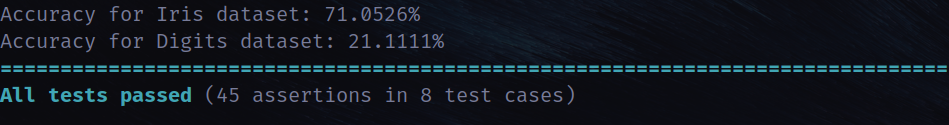

# ML P4 - Backpropagation
Deze repository bevat de uitwerking voor ML: P4 - Backpropagation in C++.

Student: Dylan McGivern<br>
Studentnummer: 1866428

## CMake
Dit project maakt gebruik van CMake om te compilen. Volg de volgende commando's om dit project te compilen (mits je op een UNIX systeem zit):
```bash
mkdir temp/
cd temp/
cmake ..
make
./test
```

## Doxygen
Op het pad `docs/html/index.html` bevindt zich de documentatie voor deze opdracht. Dit bestand bevat documentatie voor alle klassen die zijn gemaakt. Mocht je de documentatie opnieuw willen genereren, gebruik dan de volgende commando (zorg wel dat je doxygen hebt geïnstalleerd op jouw systeem):
```bash
doxygen Doxyfile
```

## Classificaties
Voor deze opdracht zijn de [iris dataset](https://scikit-learn.org/stable/modules/generated/sklearn.datasets.load_iris.html) en [digits dataset](https://scikit-learn.org/stable/modules/generated/sklearn.datasets.load_digits.html) gebruikt om de uitwerking te testen. Hierdoor duurt het draaien van de tests best lang (~10 minuten op mijn computer). Hieronder staan de resultaten mocht je het programma niet zelf willen draaien:

